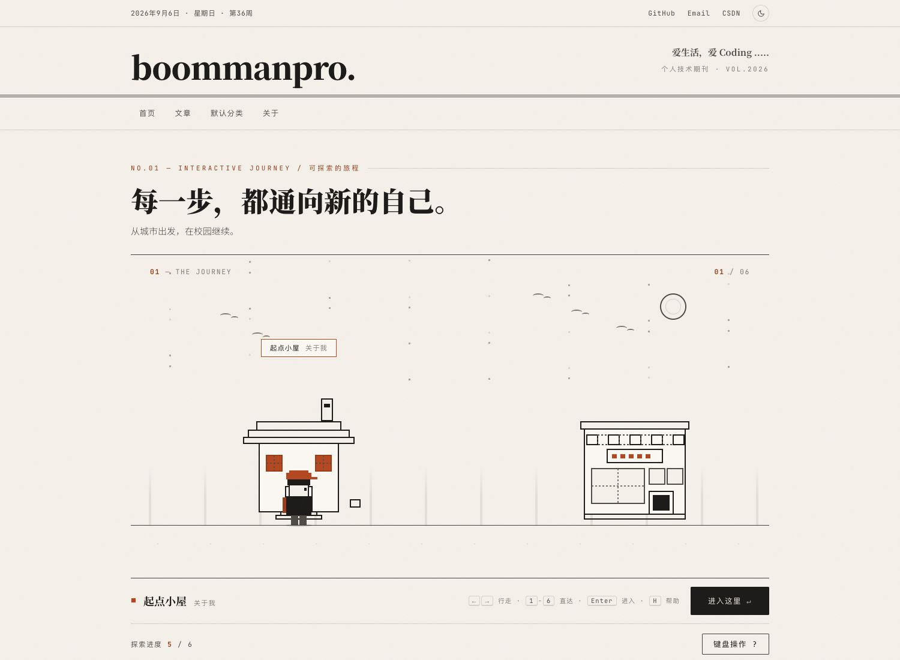
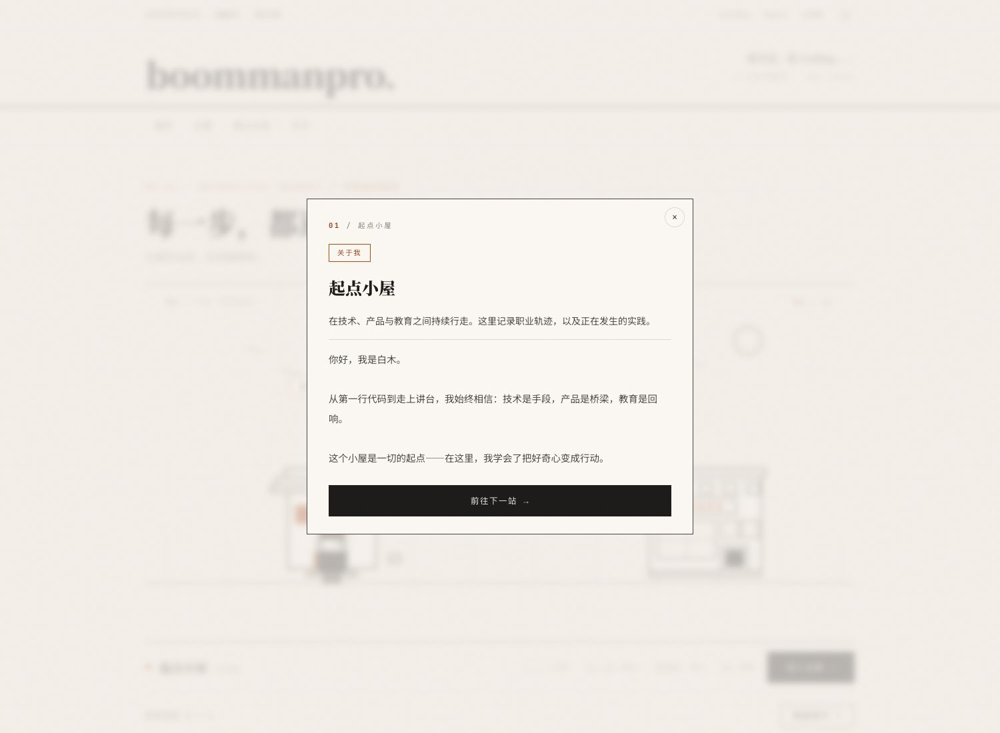
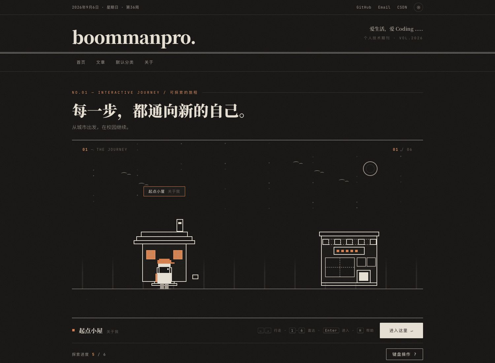
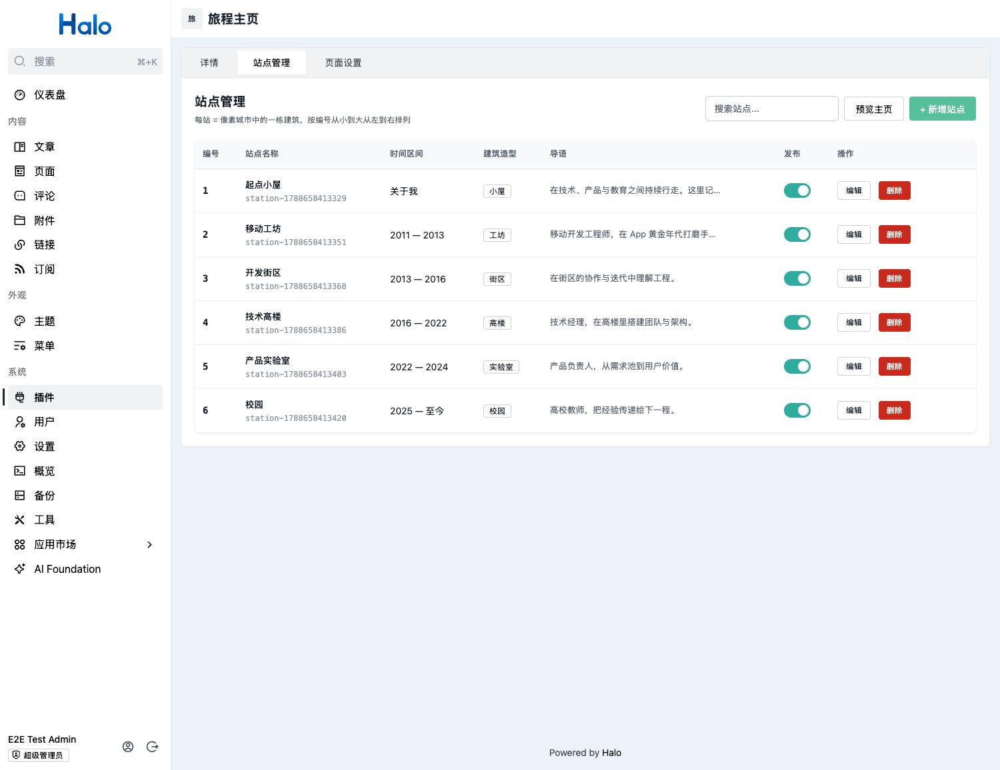
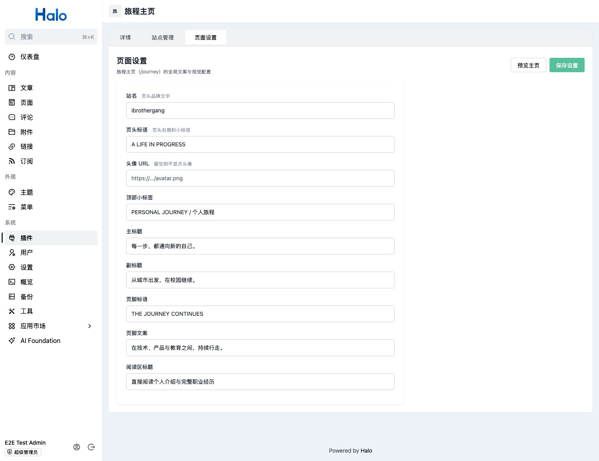

# Halo Journey Home · 旅程主页

一个游戏化的 Halo 交互式旅程主页插件：把个人履历做成一座**可探索的像素城市**，访客用键盘操控像素小人沿街道行走，走进每栋建筑阅读人生章节。

> 从城市出发，在校园继续 —— 每一步，都通向新的自己。



## 特性

- **像素城市探索**：6 种建筑造型（小屋 / 工坊 / 街区 / 高楼 / 实验室 / 校园）沿街道排布，云、飞鸟、日夜天空氛围
- **完全键盘控制**：行走、直达、进入章节、帮助面板，全程无需鼠标（也支持触屏点击）
- **深浅色自适应**：夜间自动切换星空、月亮与亮灯窗户的线稿视觉
- **章节阅读**：Enter 进入建筑弹出章节卡片，支持 Markdown 内容与「前往下一站」连续阅读
- **探索进度**：localStorage 记录已访问站点，目录区实时显示进度
- **Console 管理端**：站点 CRUD、发布开关、排序，全局文案（标题 / 标语 / 页脚）可视化配置





## 环境要求

| 依赖 | 版本 |
| --- | --- |
| Halo | >= 2.20.0 |
| 主题 | [halo-theme-boommanpro](https://github.com/boommanpro/halo-theme-boommanpro)（页面由主题 `journey` 模板渲染） |

> 本插件采用 **API-only 架构**：插件负责站点数据模型与公开数据接口（`/journey-api/*`），页面 UI 由 boommanpro 主题的 `journey` 模板渲染，与主题纸墨风格完全融合。若使用其他主题，前台页面无法渲染，但数据接口与管理端不受影响。

## 安装

### 方式一：Release 下载

1. 前往 [Releases](https://github.com/boommanpro/halo-plugin-journey-home/releases) 下载最新的 `halo-plugin-journey-home-x.y.z.jar`
2. Halo Console → 插件 → 安装 → 上传 JAR
3. 启用插件

### 方式二：在线安装

在插件安装页使用 Release 地址直接安装。

## 使用

### 1. 创建旅程页面

1. 安装并启用 [boommanpro 主题](https://github.com/boommanpro/halo-theme-boommanpro)
2. Console → 页面 → 创建页面，slug 建议 `journey`
3. 模板选择 **「Journey 交互式旅程」**
4. 发布后访问 `/journey` 即可

### 2. 配置站点



Console → 插件 → 旅程主页 → **站点管理**：

- 新增站点：名称、时间区间（如 `2013 — 2016`）、建筑造型、导语、Markdown 正文
- 支持搜索、编辑、删除、发布开关
- 编号即街道上的排列顺序

### 3. 全局文案



Console → 插件 → 旅程主页 → **页面设置**：配置主标题、副标题、页头标语、页脚文案、阅读区标题等，保存后前台即时生效。

## 键盘操作

| 按键 | 功能 |
| --- | --- |
| `←` `→` / `A` `D` | 左右行走（按住持续移动） |
| `Enter` / `↵` | 进入当前建筑 |
| `1` - `9` | 直达第 N 站（自动行走） |
| `H` / `?` | 打开键盘操作指南 |
| `Esc` | 关闭弹窗 |

## 技术实现

```
halo-plugin-journey-home/
├── src/main/java/run/halo/journeyhome/
│   ├── extension/     # JourneyStation / JourneyPageConfig 自定义模型
│   ├── endpoint/      # 公开 API（/journey-api）+ Console 管理 API
│   └── service/       # 站点服务
└── ui/                # Console 管理端（Vue 3 + @halo-dev/console-shared）
    └── src/views/     # 站点列表 / 站点编辑 / 页面设置
```

前台页面（像素小人、rAF 游戏循环、键盘状态机）在主题模板 `templates/journey.html` 中实现，全部使用主题 CSS 变量，自动适配深浅色。

### 公开接口

| 接口 | 说明 |
| --- | --- |
| `GET /journey-api/stations` | 已发布站点列表（无需登录） |
| `GET /journey-api/config` | 全局页面文案（无需登录） |

## 开发

```bash
# 构建（自动安装前端依赖并打包 Console UI）
./gradlew build

# 产物
build/libs/halo-plugin-journey-home-x.y.z.jar
```

要求：JDK 21、Node 20+、pnpm 9。

## License

[MIT](https://opensource.org/licenses/MIT)
